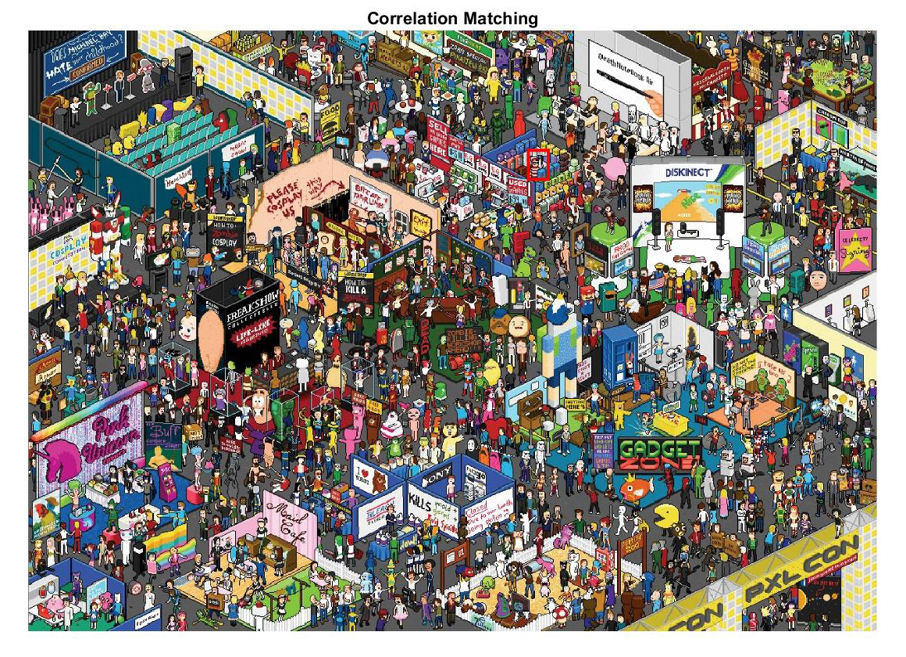
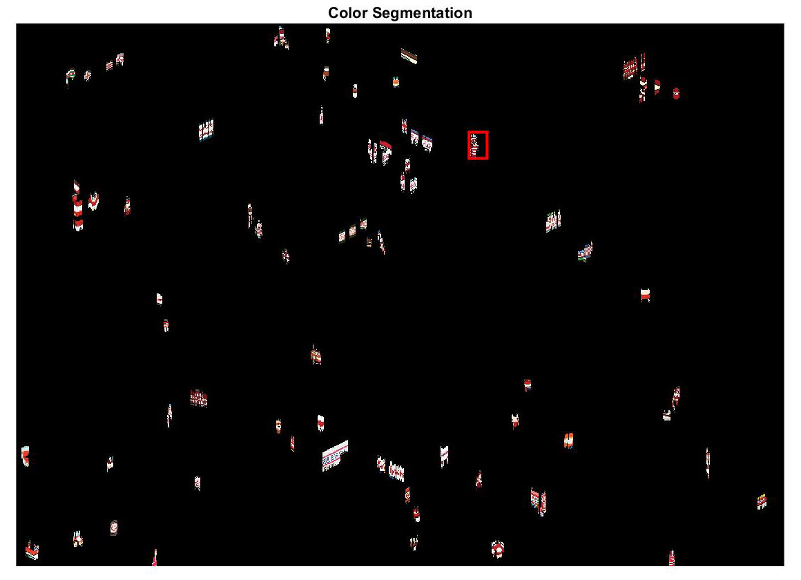

**Where Is Wally -- Image Processing Object Recognition**
========================

Introduction
------------------------
This is originally an assignment from Image Processing module -- Where Is Wally. This project aims to locate an object from an image.

Scenario
------------------------
Wally ([Wally.png](Wally.png)) is lost at a Cosplay convention ([Where.jpg](Where.jpg)). Find him.

- Correlation matching would work well here for starters;

- Challenge : Using this method on the full-size image ([WhereLarge.jpg](WhereLarge.jpg)) is painfully slow. See if you can find Wally without using the template image but instead by recognising Wally and his stylish red and white T-shirt. (try colour segmentation then morphology here);

Results
------------------------
| Correlation Matching | Color Segmentation |
| :---: | :---: |
|  |  |

Licensing
------------------------
Please see the file named [LICENSE.md](LICENSE.md).

Author
------------------------
* Chen Yumin  

Contact
------------------------
* Chen Yumin: [*http://chenyumin.com/*][1]
* CharmySoft: [*http://CharmySoft.com/*][2]  
* About: [*http://CharmySoft.com/about*][3]  
* Email: [*hello@chenyumin.com*](mailto:hello@chenyumin.com)  

[1]: http://chenyumin.com/ "Chen Yumin"
[2]: http://www.CharmySoft.com/ "CharmySoft"
[3]: http://www.CharmySoft.com/about "About CharmySoft"
